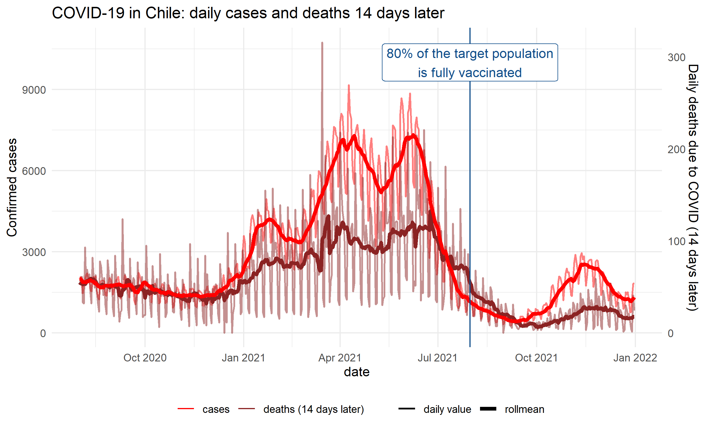
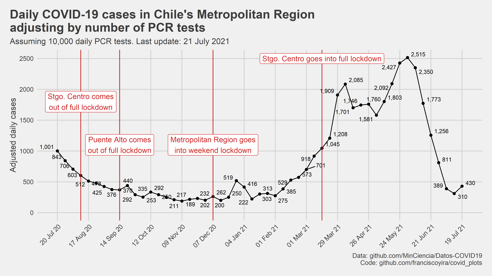

# covid_plots

Data visualisations about the COVID-19 pandemic.

<!--- 1.  [Animated map of COVID restrictions in Santiago (2020-2022)](#animated-map-of-covid-restrictions-in-santiago-2020-2022) --->

## Animated map of COVID restrictions in Santiago (2020-2022)

A map created with `gganimate` showing how COVID restrictions and lockdown severity evolved in Santiago (Chile) since the outbreak of the COVID-19 pandemic.

The geographic layout (geometries) comes from the [`sinimr` R package](https://github.com/robsalasco/sinimr).

Each frame of the animated plot represents a day, and the colours represent the levels of the four-tier restriction system implemented in Chile between 2020 and 2022 as a response to the pandemic.

Code: [R script](animated_map_lockdown_levels.R)

## Daily COVID cases and lagged deaths during the vaccination process in Chile

A time series plot to track the relationship between COVID cases and deaths in Chile since the country started its vaccination process. The deaths series is lagged in 14 days under the assumption that COVID cases today predict deaths 14 days later. For both series, a 7-day roll mean is also shown to get rid off the weekly seasonality and better visualise the underlying trends.

Code: [R script](cases_vs_offset_deaths.R)

## Adjusted daily confirmed COVID cases in Chile's Metropolitan Region

Confirmed COVID cases can increase both due to an increase in real cases or an increase in testing (i.e. if there is a exogeneous increase in PCR tests, confirmed cases are going to increase even if the virus prevalence is the same). This plot was an attempt to adjust by this source of variation and get an estimate of COVID cases would the testing rate been held constant (i.e. an estimate that only fluctuates due to the prevalence of the virus in the population). 

Under the hood, this plot uses a linear model with daily data that has a different intercept for each week but constant slope (confirmed cases ~ PCR tests) for all the weekly regression lines. The data point visualised for each week is the fitted value of each regression line for PCR tests = 10,000. A key assumption is that the prevalence of the virus is approximately constant within each week but varies across weeks. 

BTW, I don't have an epidemiology background, so you shouldn't take this too seriously, nor take this methodology as something to replicate. I made this just to inform conversations with friends and coworkers about the outlook of the pandemic in Santiago.

Code: [R script](adjusted_covid_cases.R)

## Data sources

-   [COVID-19 data repository (Ministry of Science, Chilean Government)](https://github.com/MinCiencia/Datos-COVID19/)
