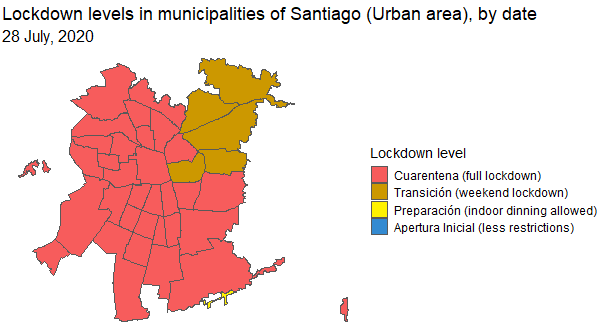

# covid_plots

Data visualisations about the COVID-19 pandemic.

<!--- 1.  [Animated map of COVID restrictions in Santiago (2020-2022)](#animated-map-of-covid-restrictions-in-santiago-2020-2022) --->

## Animated map of COVID restrictions in Santiago (2020-2022)

A map created with `gganimate` showing how COVID restrictions and lockdown severity evolved in Santiago (Chile) since the outbreak of the COVID-19 pandemic.

The geographic layout (geometries) comes from the [`sinimr` R package](https://github.com/robsalasco/sinimr).

Each frame of the animated plot represents a day, and the colours represent the levels of the four-tier restriction system implemented in Chile between 2020 and 2022 as a response to the pandemic.

Code: 

## Data sources

-   [COVID-19 data repository (Ministry of Science, Chilean Government)](https://github.com/MinCiencia/Datos-COVID19/)
